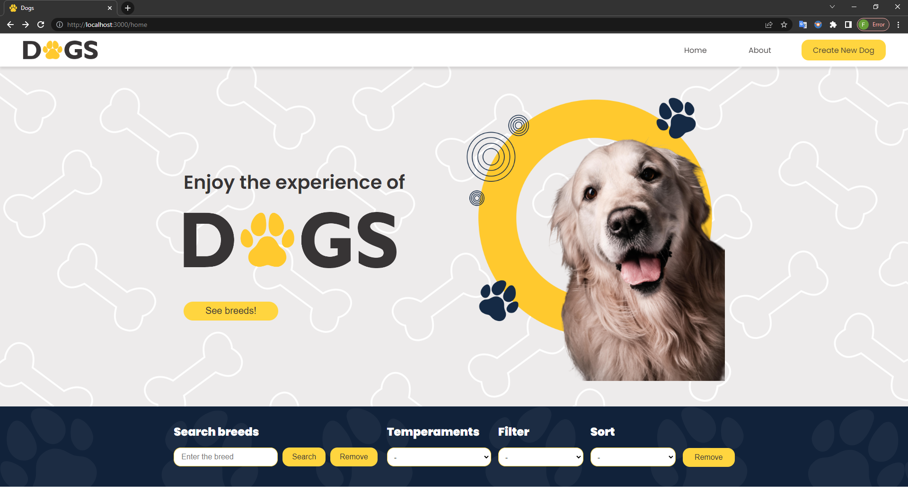
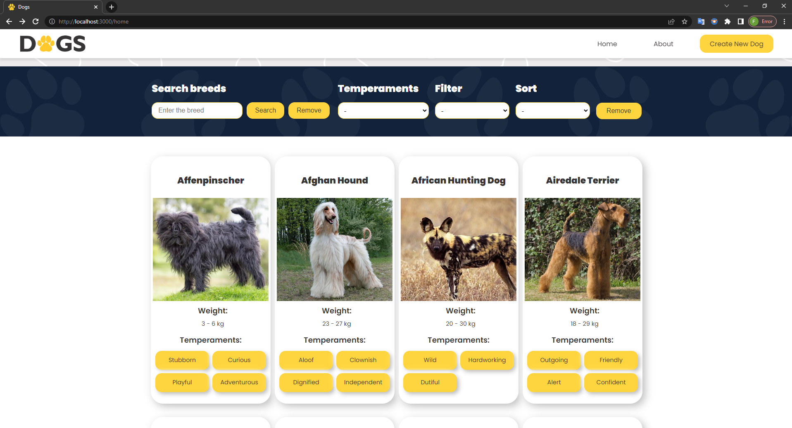
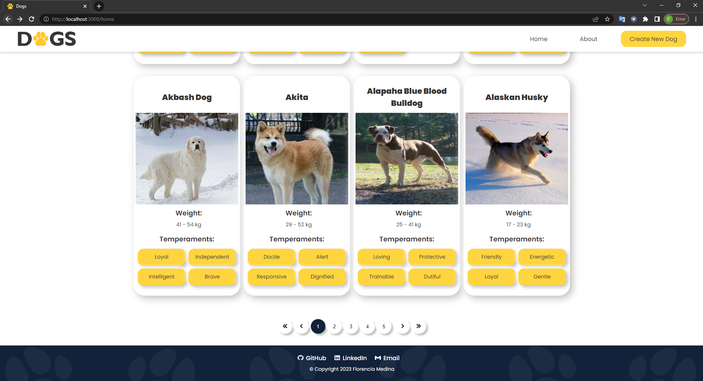

# **DOGS** | Proyecto Individual

## **📌 OBJETIVOS**

- Construir una Single Page Application de DOGS 🐶.

<br />

---

## **📌 DESCRIPCIÓN DEL PROYECTO**

- En ella se podrá:

✅ Buscar razas de perros.
<br />
✅ Filtrar por razas y/o temperamentos.
<br />
✅ Ordenar por peso y alfabéticamente.
<br />
✅ Filtrar y ordenar de manera combinada.
<br />
✅ Ver el detalle de cada raza.
<br />
✅ Crear un nuevo perro mediante un formulario dinámico.

<br />

---

## **⚠️ TECNOLOGÍAS**

- **React**, **Redux**, **Node**, **Express** y **Sequelize**

<br />

---

## **⚠️ REQUISITOS PARA INSTALAR LOCALMENTE**

1. Instalar PostgreSQL.
2. Crear una base de datos con el nombre de 'dogs'.
3. Dentro de ./api crear un archivo .env con sus credenciales, como se muestra a continuación:

   ```env
       DB_USER=usuariodepostgres
       DB_PASSWORD=passwordDePostgres
       DB_HOST=localhost
   ```

Reemplazar `usuariodepostgres` y `passwordDePostgres` con tus propias credenciales para conectarte a PostgreSQL.

<br />

## **⚠️ INSTALACIÓN**

Utilice el administrador de paquetes npm para instalar. (Recuerde usar este comando dentro de ./client y dentro de ./api):

**npm install**

<br />

## **⚠️ EJECUCIÓN LOCAL**

- Frontend -> dentro de ./cliente

**npm start**

- Backend -> dentro de ./api

**npm start**

<br />

**📍 LANDING PAGE |**

**Imágenes**


**Video**

[![Landing Page]](https://drive.google.com/file/d/1nHgZ55gUAta2vz4JCbw7LRjL3fLPoWGa/view?usp=sharing)

<br />

**📍 HOME PAGE |**

**Imágenes**



<br />



<br />



<br />

**📍 DETAIL PAGE |**

<br />

**📍 FORM PAGE |**:

<br />

---

<br />
